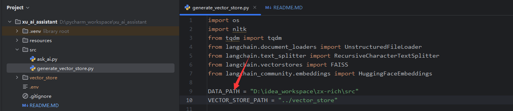
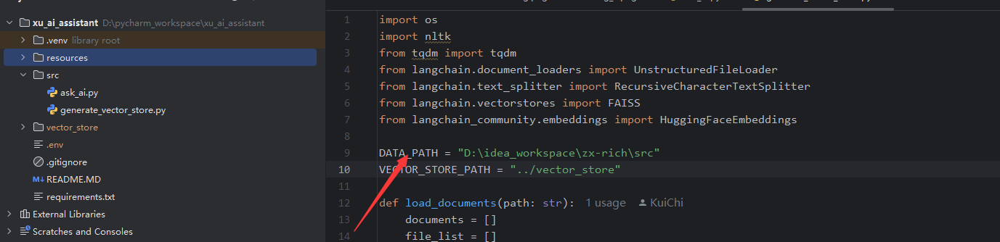

# 通用本地知识库问答系统（RAG）+ DeepSeek LLM 的流式输出助手

# 使用流程

1、配置本地知识库所在目录

2、创建 .env 文件，写入 Deepseek 密钥（api key）例：

3、安装依赖： pip install -r requirements.txt

4、生成向量知识库：python generate_vector_store.py

5、启动问答助手：python ask_ai.py