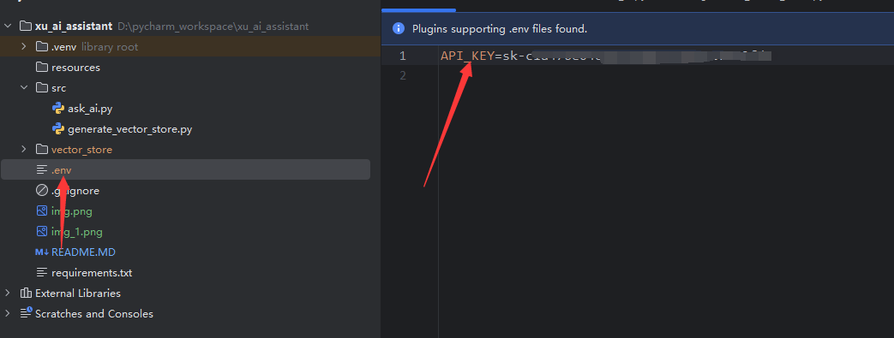

# 通用本地知识库问答系统（RAG）+ DeepSeek LLM 的流式输出助手

# 使用流程

## 1、配置本地知识库所在目录

## 2、创建 .env 文件，写入 Deepseek 密钥（api key）例：

## 3、安装依赖（py3.11）：
pip install -r requirements.txt

pip install textract python-magic-bin (linux安装python-magic)

amd 显卡需要额外装：pip install optimum[onnxruntime] onnxruntime-directml

## 4、生成向量知识库
python generate_vector_store.py

## 5、启动问答助手
python ask_ai.py